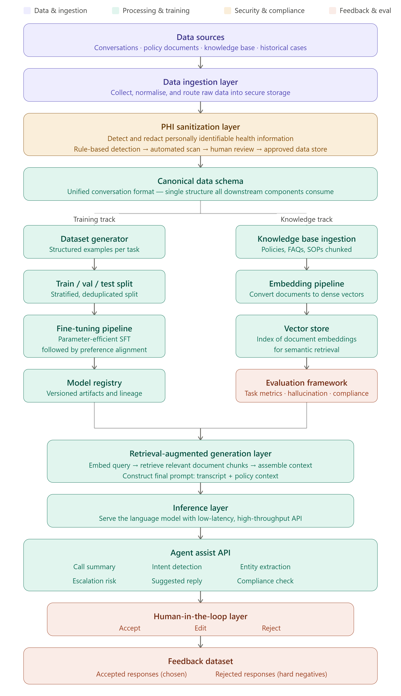

# Healthcare Contact Center SLM

---

## Business Context

### Industry Challenges

Healthcare contact centers serve as a critical engagement channel between healthcare organizations and their members, providers, and patients. These interactions involve complex policy inquiries, claims questions, benefit explanations, prior authorizations, and care-related guidance.

Customer service representatives must rapidly navigate large volumes of documentation, operational procedures, and regulatory requirements while delivering accurate and compliant responses — all while managing high interaction volumes and member expectations.

### Business Impact

Operational inefficiencies in healthcare contact centers create measurable downstream effects:

| Challenge | Business Impact |
|---|---|
| Long Average Handle Times | Increased operational cost per interaction |
| Knowledge fragmentation | Inconsistent responses across agents |
| Manual summarization | Wasted agent time on non-value activities |
| Escalation delays | Reduced member satisfaction |
| Compliance gaps | Regulatory risk and audit exposure |
| High onboarding effort | Slower agent productivity ramp |

### Problem Statement

Healthcare contact centers face several compounding operational challenges that traditional tooling does not adequately address:

- **Long Average Handle Times (AHT)** driven by fragmented knowledge retrieval
- **Knowledge scattered across multiple systems** requiring agents to context-switch constantly
- **Inconsistent agent responses** creating compliance and satisfaction risks
- **Manual call summarization** consuming agent time post-interaction
- **Escalation identification delays** that reduce first-call resolution rates
- **Regulatory and compliance risks** from unvalidated agent responses
- **Limited reuse of historical interaction intelligence**
- **High onboarding effort** for new agents unfamiliar with domain policies

Traditional contact center tooling focuses primarily on workflow management and ticket handling, rather than intelligent assistance and decision support.

### Design Inputs

The platform design is informed by the following inputs:

- Contact center operational data and interaction transcripts
- Existing knowledge repositories, policy documents, and SOPs
- Regulatory and compliance requirements specific to healthcare operations
- Agent workflow patterns and common interaction types
- Historical escalation data and resolution outcomes
- Member feedback and satisfaction signals

### Constraints

| Constraint | Description |
|---|---|
| Regulatory compliance | All data handling must conform to applicable healthcare privacy regulations |
| PHI protection | No personally identifiable health information may enter model training without sanitization |
| Response accuracy | Model outputs must be grounded in verified enterprise knowledge |
| Latency | Real-time agent assist requires low-latency inference |
| Human oversight | All AI suggestions remain subject to agent review and approval |
| Data residency | Healthcare data must remain within designated secure boundaries |

### Platform Goals

The Healthcare Contact Center SLM initiative aims to:

- Reduce Average Handle Time (AHT)
- Improve First Call Resolution (FCR)
- Accelerate agent onboarding
- Improve response consistency across agents
- Enhance regulatory compliance adherence
- Reduce manual documentation and summarization effort
- Improve customer satisfaction scores
- Establish a continuously learning AI ecosystem grounded in operational feedback

### Solution Direction

The platform takes a domain-specialization approach: rather than relying on a general-purpose large language model for all tasks, the solution trains and aligns a smaller, domain-specific model purpose-built for healthcare contact center operations. This is combined with Retrieval-Augmented Generation (RAG) to ground all responses in verified enterprise knowledge, and a human feedback loop to continuously improve quality over time.

---

## Architecture

### Solution Overview

Healthcare Contact Center SLM combines the following capabilities into a unified intelligence platform:

- **Domain-specific language models** trained on healthcare contact center data
- **Retrieval-Augmented Generation (RAG)** for knowledge-grounded responses
- **Enterprise knowledge retrieval** across policies, SOPs, and FAQs
- **Agent assistance services** surfaced at the point of interaction
- **Human feedback loops** for continuous quality improvement
- **Model optimization cycles** driven by operational outcomes

### Platform Positioning

The platform is positioned as an **augmentation layer** on top of existing contact center infrastructure. It does not replace agent workflows — it enhances them by providing real-time intelligence, contextual guidance, and automated assistance at every stage of an interaction.

```
Existing Contact Center Infrastructure
         ↓
Healthcare Contact Center SLM (augmentation layer)
         ↓
Agent Desktop — AI-assisted interactions
```

### Architecture Layers

The platform is organized into four major functional layers:

| Layer | Responsibility |
|---|---|
| **Data Processing Layer** | Ingestion, governance, sanitization, and preparation of healthcare data |
| **AI Training Layer** | Model training, alignment, evaluation, and versioning |
| **Knowledge & Inference Layer** | Retrieval, generation, and real-time AI service delivery |
| **Feedback Layer** | Human feedback capture and dataset preparation for future improvement |

### End-to-End Architecture Diagram

The diagram below represents the full platform architecture from data sources through to the feedback dataset.



The architecture follows two parallel tracks that converge at the RAG and inference layers:

- **Training track** — transforms conversation data into fine-tuned, domain-adapted models
- **Knowledge track** — converts enterprise documents into a searchable semantic knowledge store

Both tracks feed the RAG orchestration layer, which constructs grounded prompts for the inference model. The resulting AI outputs are reviewed by human agents, and their feedback is captured to improve future model versions.

---

## Workflow

### Stage 1: Data Collection

**Objective:** Collect the structured and unstructured information required for training, retrieval, and inference.

**Sources:**

- Customer conversations and contact center interaction records
- CRM system exports
- Policy documents and knowledge repositories
- Claims system records
- Member information systems
- Synthetic datasets for low-coverage scenarios
- Public healthcare datasets for domain pre-training

**Outcome:** A centralized collection of conversation and knowledge assets ready for downstream processing.

---

### Stage 2: Data Ingestion

**Objective:** Bring information from multiple enterprise systems into a unified platform.

**Activities:**

| Activity | Description |
|---|---|
| Data acquisition | Pull from source systems via batch, streaming, or file upload |
| Data validation | Check format integrity, completeness, and schema conformance |
| Metadata enrichment | Tag records with source, timestamp, type, and interaction context |
| Storage and governance | Route to secure storage with appropriate access controls |

**Outcome:** Raw datasets available for downstream compliance validation and processing.

---

### Stage 3: PHI Sanitization

**Objective:** Protect sensitive healthcare information and ensure regulatory compliance before any data enters training or inference pipelines.

**Protected Information Categories:**

- Patient and member names
- Member identifiers and account numbers
- Phone numbers and email addresses
- Medical record numbers
- Physical addresses
- Date-of-birth and other demographic identifiers

**Sanitization Pipeline:**

```
Raw data
   ↓
Rule-based detection (regex patterns, known formats)
   ↓
Automated scan (ML-based PHI detection)
   ↓
Human review (high-risk records)
   ↓
Approved data store (tagged: phi_verified=true)
```

!!! warning
    Any record that fails PHI verification at any stage is **rejected entirely** — it is never patched or partially sanitized and passed downstream.

**Outcome:** Compliant datasets suitable for AI training and operational use.

---

### Stage 4: Canonical Data Standardization

**Objective:** Normalize data originating from different source systems into a common enterprise format that all downstream components can consume without additional transformation.

**Standardized Schema Components:**

| Field | Description |
|---|---|
| `conversation_id` | Unique identifier for the interaction |
| `messages` | Ordered list of customer and agent turns |
| `metadata` | Source system, timestamp, channel, agent ID |
| `labels` | Pre-existing classification tags if available |
| `annotations` | Human-provided quality or intent annotations |

**Before standardization** — each source system uses a different structure:

```json
// Genesys
{ "callId": "123", "transcript": [...] }

// CRM
{ "ticketId": "123", "conversation": [...] }
```

**After standardization** — unified format:

```json
{
  "conversation_id": "123",
  "messages": [
    { "role": "customer", "text": "I received a bill for an MRI." },
    { "role": "agent", "text": "Let me look that up for you." }
  ],
  "metadata": { "source": "genesys", "timestamp": "2024-01-15T10:23:00Z" }
}
```

**Outcome:** Standardized datasets consumable across the entire platform without per-source adapters.

---

### Stage 5: Training Dataset Preparation

**Objective:** Generate high-quality, task-specific training datasets for each AI capability.

**Supported Tasks and Example Structures:**

=== "Call Summarization"
    **Input:** Full de-identified conversation transcript

    **Output:**
    ```json
    {
      "reason": "Member disputing MRI bill",
      "resolution": "Prior auth review initiated",
      "sentiment": "frustrated",
      "action_items": ["Submit retroactive prior auth", "Follow up in 5 days"],
      "policy_refs": ["PA-IMG-001"]
    }
    ```
    **Target size:** 5,000–10,000 examples

=== "Intent Detection"
    **Input:** Conversation transcript or opening customer utterance

    **Output:**
    ```json
    { "intent": "billing_dispute" }
    ```
    **Target size:** 2,000–5,000 examples per intent across ~30 intent categories

=== "Entity Extraction"
    **Input:** Conversation transcript

    **Output:**
    ```json
    {
      "entities": [
        { "type": "member_id", "value": "[MEMBER_ID]", "span": [12, 20] },
        { "type": "claim_number", "value": "[CLAIM_ID]", "span": [45, 53] }
      ]
    }
    ```
    **Target size:** 3,000–5,000 examples

=== "Agent Response Generation"
    **Input:** Transcript + retrieved KB context chunks

    **Output:** Suggested agent reply grounded in retrieved policy

    **Target size:** 10,000–20,000 examples (highest-value task)

=== "Escalation Prediction"
    **Input:** Conversation transcript

    **Output:**
    ```json
    { "escalation_risk": "high" }
    ```
    **Target size:** 3,000–5,000 examples, balanced classes

=== "Compliance Validation"
    **Input:** Proposed agent response draft

    **Output:**
    ```json
    { "violates": true, "reason": "References specific dollar amount without prior auth confirmation" }
    ```
    **Target size:** 2,000–3,000 examples

**Dataset activities:**

- Structured example generation per task
- Length and format validation (50–4,096 tokens)
- Deduplication using similarity-based methods
- 80 / 10 / 10 stratified train / val / test split
- Synthetic augmentation for tasks with fewer than 500 real examples

**Outcome:** Production-ready training datasets stored in secure, versioned storage.

---

### Stage 6: Model Training and Alignment

**Objective:** Create healthcare-specialized language models optimized for contact-center operations.

**Training Approach:**

The training pipeline uses parameter-efficient fine-tuning to adapt a general-purpose base language model to the healthcare contact center domain. This approach significantly reduces compute requirements compared to full fine-tuning while achieving strong domain-specific performance.

**Training Stages:**

| Stage | Description |
|---|---|
| Supervised Fine-Tuning (SFT) | Train on task-specific examples with gold-standard outputs |
| Preference Alignment | Optimize for response quality, tone, and policy adherence using human-preference signal |
| Quantization | Compress the model for efficient inference without significant quality loss |

**Key training configuration principles:**

- All attention and feed-forward projection layers are targeted for adaptation
- Sample packing is used to maximize GPU utilization
- Training inputs (user turns) are excluded from the loss to prevent the model from learning to generate user queries
- Validation loss is monitored at regular intervals; training stops early if improvement plateaus

**Goals:**

- Healthcare terminology and policy understanding
- Contact-center workflow awareness
- Improved response quality and tone
- Reduced hallucination rate

**Outcome:** Healthcare-focused language models ready for evaluation and deployment.

---

### Stage 7: Knowledge Base Processing

**Objective:** Convert enterprise knowledge into a structured, searchable intelligence repository.

**Knowledge Sources:**

| Source Type | Examples |
|---|---|
| Policies | Coverage policies, prior authorization requirements |
| Standard operating procedures | Claims handling, escalation protocols |
| FAQs | Common member questions and standard answers |
| Knowledge articles | Benefit explanations, network information |
| Operational guidelines | Compliance rules, response standards |

**Processing Activities:**

```
Raw documents
      ↓
Document parsing and cleaning
      ↓
Content chunking (512-token segments with overlap)
      ↓
Metadata enrichment (source, category, effective date)
      ↓
Knowledge index
```

**Outcome:** A structured enterprise knowledge repository ready for semantic search.

---

### Stage 8: Semantic Knowledge Retrieval

**Objective:** Enable intelligent, meaning-based search across enterprise knowledge.

**Activities:**

| Activity | Description |
|---|---|
| Knowledge representation | Convert document chunks into dense semantic vectors |
| Semantic indexing | Store vectors in a high-performance index for similarity search |
| Similarity search | Retrieve the most relevant chunks for a given query |
| Context retrieval | Return ranked, relevant context for prompt construction |

**Benefits:**

- Agents receive information relevant to the specific member situation, not just keyword matches
- Reduces dependency on agent memory and manual document search
- Supports accurate, policy-grounded responses

**Outcome:** A searchable knowledge foundation that powers the RAG layer.

---

### Stage 9: Evaluation Framework

**Objective:** Validate model quality, retrieval accuracy, safety, compliance, and business effectiveness before any deployment decision.

See the [Evaluation Framework](#evaluation-framework) section for full details on metrics and evaluation gates.

**Outcome:** A deployment readiness assessment covering all evaluation dimensions.

---

### Stage 10: Retrieval-Augmented Generation

**Objective:** Provide domain-grounded responses by combining enterprise knowledge retrieval with language model generation.

**RAG Workflow:**

```
1. Receive agent query or live conversation context
2. Understand query intent
3. Embed query into semantic vector space
4. Retrieve top-k relevant knowledge chunks from the index
5. Assemble retrieved context into prompt
6. Generate response using the fine-tuned model
7. Validate response for compliance
8. Surface result to agent
```

**Prompt structure:**

```
System: You are a healthcare contact center assistant. Use only the retrieved context below to answer.

Retrieved context:
[Policy chunk 1]
[Policy chunk 2]

Conversation:
[Current transcript]

Task: [summarize / suggest reply / detect intent / ...]
```

See the [RAG Framework](#rag-framework) section for full details.

**Outcome:** Context-aware, enterprise-grounded responses with significantly reduced hallucination risk.

---

### Stage 11: Inference Layer

**Objective:** Serve trained models for real-time business operations at production scale.

**Responsibilities:**

- Request intake and routing
- Prompt construction and model invocation
- Response generation and formatting
- Rate limiting, authentication, and access control

**Service characteristics:**

| Characteristic | Target |
|---|---|
| Time to first token (TTFT) | < 300ms |
| Time per output token | < 30ms |
| Availability | High availability with redundancy |
| Security | Authenticated access, no PHI in logs |

**Outcome:** Production-ready AI services accessible to agent assist consumers.

---

### Stage 12: Agent Assist Services

**Objective:** Provide AI-powered assistance to customer service representatives at the point of interaction.

Full details in the [AI Capabilities](#ai-capabilities) section.

| Capability | Description |
|---|---|
| Call summarization | Structured summary generated automatically at end of call |
| Intent detection | Real-time classification of customer objective |
| Entity extraction | Extraction of member IDs, claim numbers, ICD codes |
| Escalation prediction | Predicted likelihood that interaction will require escalation |
| Suggested responses | Context-aware reply recommendations |
| Compliance validation | Validation of proposed response against organizational policy |

**Outcome:** AI-assisted customer-service operations with reduced workload and improved consistency.

---

### Stage 13: Human-in-the-Loop Feedback

**Objective:** Capture expert agent feedback for quality assurance and future model improvement.

**Agent Actions:**

| Action | Meaning |
|---|---|
| **Accept** | AI suggestion was used as-is — positive signal |
| **Edit** | AI suggestion was partially correct — modified before use |
| **Reject** | AI suggestion was not suitable — negative signal |

**Why this matters:**

Agent feedback is the highest-quality signal available for understanding model performance in production. Accepted responses become "chosen" training examples; rejected responses become "hard negatives" for preference alignment.

**Outcome:** A continuous stream of labeled production feedback for model improvement.

---

### Stage 14: Feedback Dataset

**Objective:** Collect and organize operational feedback into structured datasets for future training and alignment cycles.

**Dataset Structure:**

| Category | Content |
|---|---|
| Accepted responses (chosen) | High-quality examples the model should learn to replicate |
| Rejected responses (hard negatives) | Failure cases the model should learn to avoid |
| Edited responses | Partially correct examples that reveal model weaknesses |

The feedback dataset is the terminal point of each interaction cycle. It feeds back into the training pipeline during scheduled retraining cycles to continuously improve model quality.

---

## AI Capabilities

### Call Summarization

Automatically generates a structured JSON summary of a completed customer interaction.

**Input:** Full de-identified conversation transcript

**Output fields:**

| Field | Description |
|---|---|
| `reason` | Primary reason for the member's contact |
| `resolution` | Outcome or action taken during the interaction |
| `sentiment` | Inferred member sentiment (positive / neutral / frustrated) |
| `action_items` | List of follow-up actions required |
| `policy_refs` | Relevant policy identifiers referenced |

**Business value:** Eliminates manual after-call work, reduces AHT, and creates a consistent record of every interaction.

---

### Intent Detection

Identifies the customer's primary objective and classifies the interaction type in real time.

**Supported intent categories include:**

- Billing inquiry
- Claims status
- Prior authorization
- Benefit explanation
- Provider network query
- Escalation request
- Enrollment and eligibility

**Evaluation metric:** Macro F1 across all intent classes

**Business value:** Enables intelligent routing, real-time agent coaching, and interaction analytics.

---

### Entity Extraction

Extracts structured healthcare and business-critical entities from conversation transcripts.

**Entity types:**

| Entity Type | Example |
|---|---|
| Member identifier | `[MEMBER_ID]` |
| Claim number | `[CLAIM_ID]` |
| ICD code | `[ICD_CODE]` |
| Drug name | `[DRUG_NAME]` |
| Date of service | `[DATE]` |
| Provider NPI | `[NPI]` |

**Evaluation metric:** Span F1 (strict and partial match)

**Business value:** Reduces manual data entry, improves CRM population accuracy, and enables downstream automation.

---

### Escalation Prediction

Predicts the likelihood that a given interaction will require supervisory intervention, enabling proactive management.

**Output:**
```json
{ "escalation_risk": "high", "confidence": 0.87 }
```

**Evaluation metric:** AUROC, Precision at 80% Recall

**Business value:** Reduces escalation response time, improves supervisor allocation, and helps identify systemic service failure patterns.

---

### Suggested Responses

Provides context-aware response recommendations to agents during live interactions, grounded in retrieved enterprise knowledge.

**Response characteristics:**

- Grounded exclusively in retrieved policy and KB content
- Tone and format aligned with organizational communication standards
- Validated for compliance before surfacing to the agent

**Evaluation:** LLM-as-judge scoring on five axes: factuality, policy adherence, tone, completeness, and brevity

**Business value:** Reduces agent cognitive load, improves response consistency, and accelerates resolution.

---

### Compliance Validation

Validates proposed agent responses against organizational policies and healthcare compliance requirements before they are sent.

**Output:**
```json
{
  "violates": true,
  "reason": "Response references specific benefit dollar amounts without referencing the member's plan-specific EOC document."
}
```

**Business value:** Acts as a final safety layer that catches non-compliant responses before they reach the member.

---

## RAG Framework

### RAG Overview

Retrieval-Augmented Generation (RAG) is the core mechanism by which the platform ensures responses are grounded in verified enterprise knowledge rather than relying solely on what the language model has memorized during training.

Without RAG, a language model may generate plausible-sounding but factually incorrect responses — particularly dangerous in a healthcare context. With RAG, every response is anchored to specific retrieved document chunks that can be audited and traced.

### Retrieval Workflow

```
Agent query / live conversation context
           ↓
Query understanding (intent classification)
           ↓
Query embedding (dense vector representation)
           ↓
Similarity search across knowledge index
           ↓
Top-k chunk retrieval
           ↓
Relevance reranking
           ↓
Context window assembly
           ↓
Prompt construction (transcript + context)
           ↓
Language model generation
           ↓
Compliance validation
           ↓
Agent assist output
```

### Knowledge Sources

| Source | Content Type |
|---|---|
| Coverage policies | Benefit limits, prior auth requirements |
| Standard operating procedures | Claims handling, escalation protocols |
| FAQs | Pre-written answers to common member questions |
| Knowledge articles | Detailed benefit and network explanations |
| Operational guidelines | Response standards and compliance rules |

### RAG Benefits

| Benefit | Impact |
|---|---|
| Reduced hallucination | Responses grounded in retrieved, verified content |
| Improved accuracy | Answers reflect current organizational policy |
| Auditability | Retrieved chunks can be surfaced alongside the response |
| Policy currency | Knowledge index is updated independently of model retraining |

---

## Model Lifecycle

### Training Pipeline

The model lifecycle follows a structured progression from base model to production-ready artifact:

```
General-purpose base model
         ↓
Supervised Fine-Tuning (SFT)
(healthcare contact center task data)
         ↓
Preference Alignment
(chosen / rejected response pairs)
         ↓
Model merge and quantization
         ↓
Evaluation gate
         ↓
Model registry (versioned artifact)
         ↓
Inference serving
```

### Preference Alignment

After supervised fine-tuning, the model undergoes preference alignment to improve tone, refusal behavior, policy adherence, and response structure.

**Preference data sources (in order of value):**

1. **Agent-graded pairs** — production outputs where agents accepted or rejected suggestions. Highest signal quality.
2. **LLM-as-judge pairs** — automated comparison of model outputs against a rubric covering factuality, policy compliance, tone, completeness, and brevity.
3. **Synthetic pairs** — generated "chosen" and "rejected" examples for scenarios not covered by production data.

**Target preference dataset size:** 1,000 pairs minimum; 3,000–5,000 for strong alignment signal.

### Model Registry

All model versions are stored in a versioned model registry that tracks:

- Base model identifier and version
- Training dataset version and hash
- Evaluation results at the time of registration
- Deployment status (candidate / shadow / production)
- Lineage linking adapter checkpoints to merged artifacts

### Evaluation Gates

No model advances to the next stage without passing all evaluation gates:

| Gate | Condition |
|---|---|
| PHI gate | Zero PHI detected in model outputs on test set |
| Hallucination gate | Unsupported claim rate < 2% on RAG faithfulness evaluation |
| Regression gate | No task metric drops more than 2 points vs. previous production model |
| Compliance gate | Zero compliance violations on policy test set |

---

## Evaluation Framework

### Evaluation Areas

The evaluation framework covers four dimensions that must all be assessed before any deployment decision:

| Dimension | What is measured |
|---|---|
| Model quality | Task-specific accuracy and output quality |
| Retrieval quality | Relevance and coverage of retrieved knowledge chunks |
| Safety and compliance | PHI leakage, hallucination rate, policy violations |
| Business effectiveness | Agent acceptance rate, handle time, resolution outcomes |

### Task-Level Metrics

| Task | Primary Metric | Secondary Metric |
|---|---|---|
| Call summarization | ROUGE-L | LLM-as-judge (5-axis rubric) |
| Intent detection | Macro F1 | Per-intent F1 |
| Entity extraction | Span F1 (strict) | Span F1 (partial) |
| Agent response | LLM-as-judge score | Agent acceptance rate |
| Escalation prediction | AUROC | Precision at 80% Recall |
| Compliance validation | Precision | False negative rate (zero tolerance) |

### Safety and Compliance Checks

**PHI leakage check:** A rule-based and model-based scan is run over all model outputs in the evaluation set. Any PHI detection is an automatic disqualification — there is no acceptable PHI leakage threshold.

**Hallucination rate:** For each claim in a model response, an automated faithfulness check verifies whether the claim is supported by the retrieved context. The target rate for unsupported claims is below 2%.

**Compliance evaluation:** A held-out set of policy test cases is run through the compliance validation capability. The false negative rate (a violating response classified as compliant) must be zero on the test set.

---

## Deployment Strategy

### Deployment Stages

New model versions follow a staged rollout path before reaching full production:

```
Candidate model (passes all eval gates)
         ↓
Shadow deployment
(runs in parallel with production, no agent-facing output)
         ↓
Controlled A/B rollout
(small % of live traffic, agent-facing)
         ↓
Full production promotion
(gated on statistical significance of KPI improvement)
```

### Validation Techniques

| Technique | Description |
|---|---|
| Shadow deployment | Candidate model processes all live traffic in parallel; outputs are logged but not shown to agents |
| Controlled A/B testing | Candidate model serves a small percentage of live traffic (typically 5%) for a minimum two-week evaluation window |
| Performance benchmarking | Automated evaluation harness runs against the held-out test set |
| Safety assessment | PHI, hallucination, and compliance checks run on shadow outputs |
| Business impact evaluation | KPIs (AHT, FCR, acceptance rate, CSAT) tracked and compared against control group |

### Production Readiness Criteria

A candidate model is approved for full production rollout when:

- All evaluation gates pass (PHI, hallucination, compliance, regression)
- A/B test shows statistically significant improvement on at least two primary KPIs
- Shadow deployment shows zero PHI leaks across the evaluation window
- Agent acceptance rate meets or exceeds the previous production model
- No performance degradation on any existing task metric by more than 2 points

---

## Business Outcomes

Organizations adopting Healthcare Contact Center SLM can realize the following outcomes:

| Area | Benefit |
|---|---|
| **Productivity** | Reduced manual effort on summarization, documentation, and knowledge retrieval |
| **Service quality** | More consistent member interactions across all agents |
| **Compliance** | Improved policy adherence with automated validation |
| **Knowledge access** | Faster, more accurate information retrieval at the point of need |
| **Agent onboarding** | Accelerated ramp time for new agents through AI-assisted guidance |
| **Operations** | Reduced average handle time per interaction |
| **Customer experience** | Improved first-call resolution and member satisfaction |
| **Intelligence** | Continuous improvement driven by operational feedback |

The platform establishes a continuously improving AI ecosystem — each interaction generates feedback that makes the next model version more accurate, more compliant, and more useful to agents.